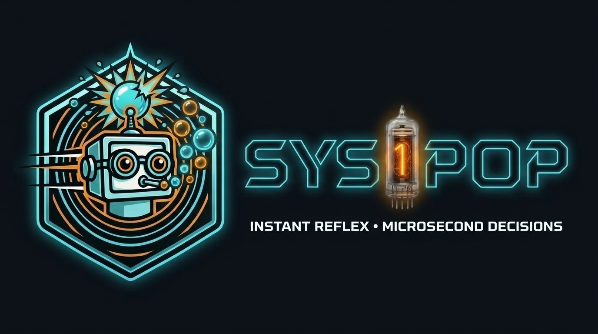

<p align="center">
  
</p>

# Sys1Pop: Autonomous Edge Decision Engine in Cloudflare Workers

An ultra-lean, autonomous "System 1" decision engine and RAG triage pipeline deployed inside Cloudflare Workers across global **PoPs** (Points of Presence) using pure Rust, Hugging Face **Candle**, and WebAssembly (`wasm32-unknown-unknown` + SIMD128).

---

## Key Highlights

- **Pure In-Worker Inference:** No external API roundtrips; executes directly within the Cloudflare V8 isolate at every edge PoP using real Candle transformer embeddings.
- **The "Cost Hack":** Consumes ~20–40ms of Worker CPU time (**~$1.00 per 1M decisions**), compared to $12.00 on Workers AI, $35–$70 on GPT-4o-mini, or recurring fees on third-party SaaS APIs.
- **400MB+ Memory Headroom:** Sized around a 33.4M–70M parameter backbone (MiniLM cross-encoders) so the remaining isolate RAM can power multi-chunk RAG triage and text pre-processing pipelines.
- **Dynamic R2 Streaming:** Model weights and tokenizers stream on-demand from Cloudflare R2 into isolate RAM with LRU caching.
- **WASM SIMD128 Accelerated:** Vector operations compiled with `-C target-feature=+simd128` for 3x–4x throughput on V8.
- **Service Bindings Support:** Call Sys1Pop from other Cloudflare Workers with zero network hop and microsecond IPC latency (<0.2ms).
- **Interactive UI Playground:** Built-in "Kick the Tires" testing studio embedded in dev mode at `http://localhost:6061`.

---

## Detailed Documentation

- 📊 **[Economics & Benchmarks](docs/economics_and_benchmarks.md):** Side-by-side cost breakdown comparing Worker CPU time, Workers AI Neurons, and cloud LLMs across 100K, 1M, and 10M requests.
- 📖 **[Frontier LLM Distillation Spec](docs/SPEC.md):** Specification for Claude, Gemini, and GPT to distill custom edge models.
- 🎨 **[Brand Guidelines & Design Kit](docs/brand_kit/BRAND_GUIDELINES.md):** Official banners, shield emblems, Nixie logotype, and color tokens.

---

## Project Structure

```
Sys1Pop
├── .cargo/
│   └── config.toml                  # SIMD128 target flags
├── Cargo.toml                       # Virtual workspace root
├── wrangler.toml                    # Cloudflare Worker config & R2 bindings
├── docs/
│   ├── SPEC.md                      # Promptable LLM Teacher specification
│   ├── economics_and_benchmarks.md  # Detailed financial & latency metrics
│   ├── brand_kit/                   # Official logo emblems, banners, and vector assets
│   └── prompts/
│       └── distill_teacher.md       # Synthetic dataset generation prompt templates
├── examples/
│   ├── spam_detection_request.json  # Sample form spam payload
│   ├── rag_triage.json              # RAG sufficiency & relevance test
│   ├── agent_intent_routing.json    # Assistant / smart home tool dispatch
│   ├── cloudflare_worker_binding_caller.ts  # Service Binding integration
│   └── Sys1Pop_Studio.ipynb          # LLM distillation Colab notebook
├── scripts/
│   ├── dev.sh                       # Local dev runner with Kick the Tires UI (:6061)
│   ├── deploy-worker.sh             # Cloudflare Worker deployment script
│   └── deploy-models.sh             # Cloudflare R2 model upload tool
├── tools/
│   ├── export_models.py             # Calibrates & exports all production model bundles
│   └── distill_and_export.py        # Distillation tool for custom domain datasets
├── packages/
│   ├── sdk/                         # @sys1pop/sdk (TypeScript client for Service Bindings)
│   └── cli/                         # npx sys1pop (Worker deploy, model push/test)
└── crates/
    ├── sys1pop-core/                # Pure Rust algorithms, heads & contracts
    │   ├── build.rs                 # SIMD128 compile-time assertion
    │   └── src/
    │       ├── contract.rs          # Typed System 1 JSON request & response schemas
    │       ├── engine.rs            # Core decision engine & neural RAG triage execution
    │       ├── model/               # QuantizedBackbone, ChoiceHead, BooleanHead, ScoreHead
    │       └── pipeline/            # RAGTriagePipeline
    └── sys1pop-worker/              # Turnkey Cloudflare Worker microservice
        ├── build/                   # WASM shim artifacts
        ├── ui/                      # Embedded Kick the Tires interactive UI
        └── src/
            ├── cache.rs             # In-isolate LRU decision cache (<0.05ms)
            ├── loader.rs            # Dynamic R2 model streaming & isolate RAM residency
            └── lib.rs               # Worker HTTP & Service Binding entrypoint (/v1/decide)
```

---

## Production Model Catalog

| Model ID | Task / Purpose | Heads & Outputs | Default Thresholds |
| :--- | :--- | :--- | :--- |
| **`sys1-base`** | General representation & System 1 triage | `primary_intent` (choice), `requires_action` (boolean), `priority_level` (score 1–5) | Calibrated |
| **`spam-detector-v1`** | Web form spam & phishing detection | `is_spam` (boolean), `spam_category` (choice), `risk_score` (score 1–5) | `default_threshold: 0.5` |
| **`rag-triage-v1`** | Multi-chunk passage scoring & pruning | Neural cosine similarity, `sufficient_context` (bool), `action_required` (choice) | `rel: 0.35, suff: 0.50` |
| **`intent-router-v1`** | Omni-box agent routing & tool dispatch | `primary_route` (choice), `requires_confirmation` (bool), `urgency_level` (1–3) | Calibrated |

---

## Local Development & Testing

### Prerequisites
- Rust with `wasm32-unknown-unknown` target:
  ```bash
  rustup target add wasm32-unknown-unknown
  ```
- Node.js & npm (`wrangler` installed or executed via `npx`)
- Worker-build:
  ```bash
  cargo install worker-build
  ```

### Run Workspace Tests
```bash
cargo test --workspace
```

### Launch Local Development Server & Playground
```bash
./scripts/dev.sh
# or: npm run dev
```
Open **`http://localhost:6061`** in your browser to inspect models, calibrate thresholds, and test real neural decisions in the interactive **Kick the Tires** UI.

### Test Decision API Endpoint
```bash
curl -X POST http://localhost:6061/v1/decide \
  -H "Content-Type: application/json" \
  -d '{
    "model": "sys1-base",
    "state": "Our production database is experiencing connection exhaustion and 500 errors across all nodes, critical!",
    "questions": [
      { "type": "choice", "id": "primary_intent", "options": ["information_lookup", "transaction_request", "escalation", "general_feedback"] },
      { "type": "boolean", "id": "requires_action" },
      { "type": "score", "id": "priority_level", "min": 1, "max": 5 }
    ]
  }'
```

---

## Security & Authentication

Sys1Pop provides flexible token-based authentication and lifecycle access controls via Cloudflare Worker environment variables or secrets:

| Environment Variable | Type | Default | Description |
| :--- | :--- | :--- | :--- |
| **`API_TOKEN`** | Secret / Var | `""` | Secret token required for authenticated requests. Accepted via `Authorization: Bearer <token>` or `X-API-Token: <token>`. |
| **`SECURE_DECIDE_API`** | Var | `false` | When set to `true`, **expands `API_TOKEN` authentication to secure the `/v1/decide` inference route** for production deployment. |
| **`ENABLE_ADMIN_API`** | Var | `true` | When set to `false`, completely disables admin lifecycle APIs (`/v1/models/unload`, `/v1/cache/clear`) with HTTP 403 Forbidden. |
| **`ENABLE_UI`** | Var | `false` | Enables embedded Kick the Tires interactive testing studio at `/` and `/ui`. Secured by disabling it in production. |

### Authenticating Requests
When `SECURE_DECIDE_API=true`, decision requests must include the token:
```bash
curl -X POST https://sys1pop.your-domain.workers.dev/v1/decide \
  -H "Authorization: Bearer my-secret-token" \
  -H "Content-Type: application/json" \
  -d '{"model":"sys1-base","state":"Status check","questions":[{"id":"ok","type":"boolean"}]}'
```

Using the `@sys1pop/sdk`:
```typescript
import { Sys1Pop } from "@sys1pop/sdk";

// Direct HTTP endpoint with token authentication:
const sys1 = new Sys1Pop({
  endpoint: "https://sys1pop.your-domain.workers.dev",
  token: process.env.API_TOKEN,
});

// Or Cloudflare Worker Service Binding with token:
const sys1 = new Sys1Pop({
  binding: env.SYS1POP,
  token: env.SYS1POP_API_TOKEN,
});
```

---

## License

Sys1Pop is dual-licensed under:

* Apache License, Version 2.0 ([LICENSE-APACHE](LICENSE-APACHE) or http://www.apache.org/licenses/LICENSE-2.0)
* MIT License ([LICENSE-MIT](LICENSE-MIT) or http://opensource.org/licenses/MIT)

You may choose to use either license at your option.
