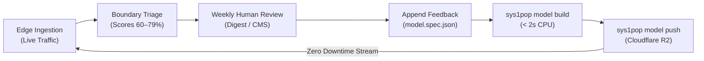

# Sys1Pop ModelForge: Declarative Edge Model Pipeline

**Sys1Pop ModelForge** is a declarative, file-driven pipeline for creating, calibrating, and deploying custom neural decision models directly to Cloudflare Workers and Cloudflare R2.

Rather than training 100M+ parameter foundation models from scratch, ModelForge fits calibrated linear probe heads (`ChoiceHead`, `BooleanHead`, `ScoreHead`) on top of frozen transformer sentence representations.

* **Instant CPU Head Fitting:** Compiles in **< 2 seconds on a standard laptop CPU** without requiring a GPU.
* **Strict Edge Budget:** Automatically quantizes and packages bundles (`manifest.json`, `model.safetensors`, `tokenizer.json`, `config.json`) strictly under the **35 MB Cloudflare Worker asset limit**.
* **Zero Worker Redeployments:** Uploads directly to Cloudflare R2 (`npx sys1pop model push`). Running worker isolates stream new model bundles on demand and cache them in isolate RAM with sub-millisecond execution.
* **Decoupled Application Repositories:** Consuming applications (such as **FreeFormer** or **SlottD**) can define and version their own `model.spec.json` within their own repositories.

---

## 🚀 Quickstart (< 3 Minutes)

### Step 1: Initialize a Model Specification
Inside any project repository, run:

```bash
npx sys1pop model init --name support-triage-v1 --type multi-head
```

This scaffolds a schema-validated `support-triage-v1.spec.json` with sample choice, boolean, and score questions.

### Step 2: Define Questions and Examples
Edit the specification to match your application's domain questions and provide few-shot examples:

```json
{
  "$schema": "https://sys1pop.dev/schema/model.spec.v1.json",
  "model_id": "support-triage-v1",
  "name": "Customer Support & Incident Router",
  "questions": [
    {
      "id": "department",
      "type": "choice",
      "options": ["billing", "technical_support", "sales", "general"]
    },
    {
      "id": "requires_escalation",
      "type": "boolean",
      "threshold": 0.5
    },
    {
      "id": "urgency_rating",
      "type": "score",
      "min": 1,
      "max": 5
    }
  ],
  "training_examples": [
    {
      "state": "Site: store.com | Subject: Double charged on invoice #4821 and card charged twice.",
      "department": "billing",
      "requires_escalation": false,
      "urgency_rating": 2
    },
    {
      "state": "Site: app.io | Subject: Production database down with 500 errors across all clusters!",
      "department": "technical_support",
      "requires_escalation": true,
      "urgency_rating": 5
    }
  ]
}
```

### Step 3: Validate the Specification
Check syntax, question IDs, and dataset balance before training:

```bash
npx sys1pop model validate ./support-triage-v1.spec.json
```

### Step 4: Compile & Package the Bundle
Run the compiler engine to extract frozen backbone embeddings and fit calibrated probe decision heads:

```bash
npx sys1pop model build ./support-triage-v1.spec.json --output ./dist/models/support-triage-v1
```

> **Note:** ModelForge automatically uses `uv` if installed on your system to run with zero manual Python environment setup, falling back to system `python3`.

### Step 5: Publish to Cloudflare R2
Upload the compiled bundle to your R2 bucket and atomically update the remote model catalog:

```bash
npx sys1pop model push ./dist/models/support-triage-v1 --bucket sys1pop-models
```

### Step 6: Query at the Edge
Your model is immediately available across all Cloudflare edge PoPs. In your consuming worker:

```typescript
import { Sys1Pop } from "@sys1pop/sdk";

// Call via Cloudflare Worker Service Binding (zero network hop, <0.2ms)
const sys1 = new Sys1Pop(env.SYS1POP);

const decision = await sys1.decide({
  model: "support-triage-v1",
  state: "Database cluster unresponsive, connection pool exhausted!",
  questions: [
    { type: "choice", id: "department", options: ["billing", "technical_support", "sales", "general"] },
    { type: "boolean", id: "requires_escalation" },
    { type: "score", id: "urgency_rating", min: 1, max: 5 }
  ]
});

console.log(decision.getChoice("department"));           // "technical_support"
console.log(decision.getBoolean("requires_escalation")); // true
console.log(decision.getScore("urgency_rating"));       // 4.8
```

---

## 📋 `model.spec.json` Reference

Every ModelForge model is declared via a JSON or YAML file adhering to the [`schema/model.spec.v1.json`](../schema/model.spec.v1.json) specification.

### Top-Level Fields

| Field | Type | Required | Description |
| :--- | :--- | :--- | :--- |
| `model_id` | `string` | **Yes** | Alphanumeric kebab-case identifier (e.g. `support-triage-v1`). |
| `name` | `string` | **Yes** | Human-readable title for UI and logs. |
| `questions` | `array` | **Yes** | Array of 1 or more typed decision head definitions. |
| `version` | `string` | No | Semantic contract version (default: `1.0.0`). |
| `description` | `string` | No | Model overview and routing intent. |
| `icon` | `string` | No | Lucide icon slug (e.g. `shield`, `cpu`, `life-buoy`, `zap`). |
| `base_backbone` | `string` | No | Base HuggingFace transformer model. Default: `sentence-transformers/all-MiniLM-L6-v2`. |
| `quantization` | `string` | No | Edge quantization format (`fp32_edge` or `int8_q8_0`). |
| `calibration` | `object` | No | Hyperparameters for probe head solvers (see below). |
| `training_examples` | `array` | No* | Inline array of labeled examples. (*Required if `dataset_path` omitted). |
| `dataset_path` | `string` | No | Path to an external `.jsonl` or `.csv` dataset file. |
| `sample_presets` | `array` | No | Preset scenarios shown in the Kick the Tires playground UI. |

### Calibration Parameters (`calibration`)
```json
{
  "calibration": {
    "temperature": 1.0,
    "regularization_c": 5.0,
    "max_iterations": 200,
    "default_threshold": 0.5
  }
}
```
* **`temperature`** (default: `1.0`): Softmax temperature scaling factor for `ChoiceHead`.
* **`regularization_c`** (default: `5.0`): Inverse of regularization strength for the `scikit-learn` logistic regression solver. Higher values fit closer to training data; lower values prevent overfitting on noisy few-shot data.
* **`max_iterations`** (default: `200`): Maximum solver iterations on CPU.
* **`default_threshold`** (default: `0.5`): Probability cutoff for `BooleanHead`.

---

## 🧠 Decision Head Types

Sys1Pop supports three fundamental decision heads:

### 1. `ChoiceHead` (Multi-Class Categorization)
Computes a normalized probability distribution over discrete options via temperature-scaled softmax.

```json
{
  "id": "spam_category",
  "type": "choice",
  "options": [
    "legitimate_inquiry",
    "commercial_sales_pitch",
    "seo_backlink_spam",
    "crypto_phishing",
    "automated_bot_gibberish"
  ]
}
```

* **SDK Access:**
  ```typescript
  decision.getChoice("spam_category");     // string (e.g. "crypto_phishing")
  decision.getConfidence("spam_category"); // number (e.g. 0.94)
  decision.getDistribution("spam_category"); // { legitimate_inquiry: 0.01, ... }
  ```

### 2. `BooleanHead` (Binary Decision)
Computes a calibrated binary probability using sigmoid ($\sigma(z) \ge 0.5 \implies \text{true}$).

```json
{
  "id": "is_spam",
  "type": "boolean",
  "threshold": 0.5
}
```

* **SDK Access:**
  ```typescript
  decision.getBoolean("is_spam");     // boolean (e.g. true)
  decision.getProbability("is_spam"); // number (e.g. 0.982)
  ```

### 3. `ScoreHead` (Expected Value / Ordinal Rating)
Computes the expected value across bounded integer bins:
$$\mathbb{E}[S] = \sum_{i=\min}^{\max} i \cdot P(S = i)$$

```json
{
  "id": "risk_score",
  "type": "score",
  "min": 1,
  "max": 5
}
```

* **SDK Access:**
  ```typescript
  decision.getScore("risk_score"); // number (e.g. 4.62)
  ```

---

## 📂 Large Datasets: Using `dataset_path`

For datasets exceeding inline JSON capacity (> 1,000 examples), reference an external `.jsonl` or `.csv` file:

```json
{
  "$schema": "https://sys1pop.dev/schema/model.spec.v1.json",
  "model_id": "support-triage-v1",
  "name": "Customer Support Router",
  "dataset_path": "data/training_corpus.jsonl",
  "questions": [ ... ]
}
```

### Supported Formats

#### JSON Lines (`.jsonl`):
```json
{"state": "Need refund for duplicate invoice charge.", "department": "billing", "requires_escalation": false, "urgency_rating": 2}
{"state": "Cluster outage across all EU worker nodes!", "department": "technical_support", "requires_escalation": true, "urgency_rating": 5}
```

#### CSV (`.csv`):
```csv
state,department,requires_escalation,urgency_rating
"Need refund for duplicate invoice charge.",billing,false,2
"Cluster outage across all EU worker nodes!",technical_support,true,5
```

---

## 🛠 Developer CLI Reference (`sys1pop model`)

The Sys1Pop CLI (`@sys1pop/cli`) provides end-to-end tooling for model authoring and deployment:

### `sys1pop model init [path]`
Generates a pre-populated specification template.

```bash
# Flags:
#   --name <id>       Model ID (e.g. 'legal-router-v1')
#   --type <template> Template type: 'multi-head' (default), 'spam', 'triage', 'binary'
#   --force           Overwrite existing file

npx sys1pop model init ./my-model.spec.json --name legal-router-v1 --type multi-head
```

### `sys1pop model validate <spec>`
Performs instant pre-flight validation on the specification:
* Validates JSON schema adherence.
* Verifies question IDs, types, and options uniqueness.
* Checks that training labels match question contracts.
* Executes in milliseconds with **zero machine learning dependencies required**.

```bash
npx sys1pop model validate ./my-model.spec.json
```

### `sys1pop model build <spec>`
Compiles the specification into a production-ready edge bundle:
* Tokenizes examples and extracts mean-pooled sentence embeddings.
* Calibrates probe decision heads with class balancing.
* Emits `manifest.json`, `model.safetensors`, `tokenizer.json`, and `config.json`.
* Verifies the total bundle size does not exceed **35.00 MB**.

```bash
# Flags:
#   --output, -o <dir>       Target output directory (default: ./dist/models/{model_id})
#   --base-model, -b <name>  Override base transformer backbone
#   --quantization, -q <m>   Quantization format: 'fp32_edge' or 'int8_q8_0'

npx sys1pop model build ./my-model.spec.json --output ./dist/models/my-model
```

### `sys1pop model push <dir>`
Uploads the compiled bundle to Cloudflare R2 and atomically updates the remote `catalog.json`:

```bash
# Flags:
#   --bucket <name>   R2 bucket name (default: sys1pop-models)
#   --name <id>       Override target model ID in R2

npx sys1pop model push ./dist/models/my-model --bucket sys1pop-models
```

### `sys1pop model test <model-id>`
Runs a live end-to-end verification against a deployed Sys1Pop worker:
* Measures cold-start forward pass latency (~25–35 ms).
* Asserts second-query in-isolate LRU cache hit (< 1 ms at $0.00 CPU cost).

```bash
npx sys1pop model test my-model --endpoint https://sys1pop.example.workers.dev
```

### `sys1pop model list`
Lists all models currently resident in warm isolate RAM across active edge worker instances.

```bash
npx sys1pop model list --endpoint https://sys1pop.example.workers.dev
```

### `sys1pop model unload <model-id>`
Evicts a warm model bundle from isolate RAM to free memory.

```bash
npx sys1pop model unload my-model --endpoint https://sys1pop.example.workers.dev
```

---

## ⚡ TypeScript SDK Integration (`@sys1pop/sdk`)

Consuming applications can interact with models using strongly-typed helpers:

### 1. Direct Evaluation with ModelSpec
If your application imports or defines a `ModelSpec`, you can evaluate states directly without re-typing question lists:

```typescript
import { Sys1Pop, ModelSpec } from "@sys1pop/sdk";

const triageSpec: ModelSpec = {
  model_id: "support-triage-v1",
  name: "Support Incident Router",
  questions: [
    { id: "department", type: "choice", options: ["billing", "tech", "sales"] },
    { id: "requires_escalation", type: "boolean" },
    { id: "urgency_rating", type: "score", min: 1, max: 5 }
  ]
};

const sys1 = new Sys1Pop(env.SYS1POP);
const result = await sys1.decideWithSpec(triageSpec, "Production database latency is 3000ms!");

if (result.getBoolean("requires_escalation")) {
  await notifyOnCall(result.getChoice("department"), result.getScore("urgency_rating"));
}
```

### 2. Service Binding Calling Convention (Zero Network Hops)
Inside your `wrangler.toml`:

```toml
[[services]]
binding = "SYS1POP"
service = "sys1pop"
```

In your Worker handler:

```typescript
export default {
  async fetch(req: Request, env: Env): Promise<Response> {
    const sys1 = new Sys1Pop(env.SYS1POP);
    const decision = await sys1.decide({
      model: "spam-detector-v1",
      state: "Alex Taylor offering SEO backlinks DA 80+.",
      questions: [
        { type: "boolean", id: "is_spam" },
        { type: "score", id: "risk_score", min: 1, max: 5 }
      ]
    });

    if (decision.getBoolean("is_spam")) {
      return new Response("Spam detected", { status: 400 });
    }

    return new Response("OK");
  }
};
```

---

## 🔄 Active Edge Learning Loop

ModelForge enables a continuous, zero-downtime retraining loop for production applications:



1. **Borderline Detection:** Your application logs borderline decisions (e.g. FreeFormer Digest v2 flags confidence scores between 60% and 79%).
2. **Annotation:** Domain experts or moderators tag false positives or false negatives in form digests.
3. **Automated Retraining:** CI/CD rebuilds the model via `npx sys1pop model build` and uploads it with `npx sys1pop model push`.
4. **Instant Edge Propagation:** Running Cloudflare Workers immediately stream the updated bundle from R2 without rebuilding or redeploying any worker code!
