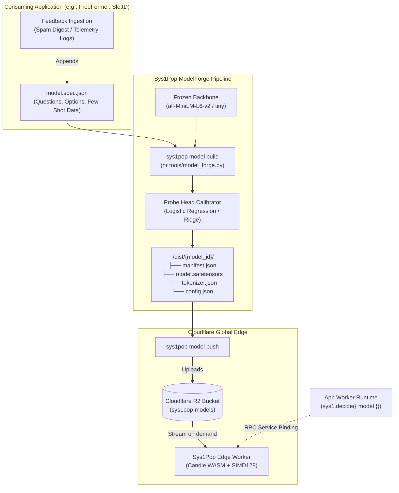

# Sys1Pop ModelForge: Declarative Edge Model Pipeline (RFC-002)

**Project Name:** `Sys1Pop ModelForge`  
**Reference ID:** `RFC-002-MODEL-FORGE`  
**Status:** Proposed / Draft  
**Target Package:** `@sys1pop/cli`, `tools/model_forge.py`, `@sys1pop/sdk`  
**Companion Documents:** [`docs/SPEC.md`](./SPEC.md), [`tools/export_models.py`](../tools/export_models.py)  

---

## 1. Executive Summary & Objective

Currently, adding or refining an edge neural decision model in Sys1Pop requires editing hardcoded Python lists inside `tools/export_models.py` within the `Sys1Pop` repository. While the edge runtime (`loader.rs`) was engineered to dynamically stream any arbitrary model bundle from Cloudflare R2 on demand with zero worker redeployments, consuming applications (such as **FreeFormer**, **SlottD**, or external services) currently lack a declarative, self-contained way to define, train, and deploy models from their own repositories.

**Sys1Pop ModelForge** establishes a file-driven, declarative edge model pipeline that enables:
1. **Decoupled Application Ownership:** Any application repository can define its own decision contracts and few-shot calibration datasets in a declarative `model.spec.json`.
2. **Instant CPU Head Fitting (< 2s):** Fits calibrated decision heads (`ChoiceHead`, `BooleanHead`, `ScoreHead`) onto frozen transformer embeddings without training a 100M+ parameter foundation model from scratch.
3. **Spec-Compliant Packaging:** Automatically emits standard INT8/FP32 `model.safetensors`, HuggingFace `tokenizer.json`, `config.json`, and `manifest.json` under 35 MB.
4. **Single-Command Edge Publishing:** Compiles and publishes bundles to Cloudflare R2 (`sys1pop model push`), making models immediately queryable across global edge PoPs with zero downtime.

---

## 2. Architecture & Dataflow



---

## 3. Declarative Specification: `model.spec.json`

An application defines its model contract, decision heads, and few-shot calibration samples in a declarative JSON or YAML manifest:

```json
{
  "$schema": "https://sys1pop.dev/schema/model.spec.v1.json",
  "model_id": "support-triage-v1",
  "name": "Customer Support & Incident Router",
  "version": "1.0.0",
  "description": "Triages customer inquiries, detects urgent SLA incidents, and routes to appropriate teams.",
  "base_backbone": "sentence-transformers/all-MiniLM-L6-v2",
  "quantization": "fp32_edge",
  "calibration": {
    "temperature": 1.0,
    "regularization_c": 5.0,
    "max_iterations": 200
  },
  "questions": [
    {
      "id": "department",
      "type": "choice",
      "options": ["billing", "technical_support", "sales", "general"]
    },
    {
      "id": "requires_escalation",
      "type": "boolean",
      "threshold": 0.5
    },
    {
      "id": "urgency_rating",
      "type": "score",
      "min": 1,
      "max": 5
    }
  ],
  "training_examples": [
    {
      "state": "Site: store.com | Name: Alice | Subject: Double charged on invoice #4821",
      "department": "billing",
      "requires_escalation": false,
      "urgency_rating": 3
    },
    {
      "state": "Site: app.io | Name: Bob | Subject: Production database down with 500 errors across all clusters!",
      "department": "technical_support",
      "requires_escalation": true,
      "urgency_rating": 5
    },
    {
      "state": "Site: agency.com | Name: Carol | Subject: Interested in enterprise pricing and custom SLA terms.",
      "department": "sales",
      "requires_escalation": false,
      "urgency_rating": 2
    },
    {
      "state": "Site: blog.dev | Name: Dan | Subject: Really liked your latest tutorial on edge caching.",
      "department": "general",
      "requires_escalation": false,
      "urgency_rating": 1
    }
  ]
}
```

---

## 4. Head Fitting & Calibration Engine

Sys1Pop relies on the mathematical principle that high-quality sentence embeddings already linearize semantic concepts. Rather than updating the base transformer's billions of matrix multiplies, ModelForge:

1. **Computes Sentence Embeddings:**
   Passes all training example states $x_i$ through the base backbone and extracts the mean-pooled, $L_2$-normalized vector:
   $$h_i = \text{Normalize}\left(\frac{\sum_t e_{i,t} \cdot m_{i,t}}{\sum_t m_{i,t}}\right) \in \mathbb{R}^{D}$$
   *(where $D = 384$ for MiniLM, $D = 128$ for tiny).*

2. **Fits Probing Decision Heads:**
   * **`ChoiceHead`:** Multinomial Logistic Regression (`softmax`) fitting $W_{\text{choice}} \in \mathbb{R}^{K \times D}$ and $b \in \mathbb{R}^K$.
   * **`BooleanHead`:** Binary Logistic Regression (`sigmoid`) fitting $w_{\text{bool}} \in \mathbb{R}^{1 \times D}$ and $b \in \mathbb{R}$.
   * **`ScoreHead`:** Ordinal Logistic Regression or bounded linear projection fitting $W_{\text{score}} \in \mathbb{R}^{B \times D}$ and $b \in \mathbb{R}^B$.

3. **Packaging safetensors:**
   Appends the calibrated weights directly into the safetensors file under namespaced keys:
   * `heads.choice.{id}.weight` and `heads.choice.{id}.bias`
   * `heads.boolean.{id}.weight` and `heads.boolean.{id}.bias`
   * `heads.score.{id}.weight` and `heads.score.{id}.bias`

4. **Emits Compliant Bundle:**
   Writes `manifest.json`, `model.safetensors`, `tokenizer.json`, and `config.json` into the target output directory, verifying total bundle size is $\le 35\text{ MB}$.

---

## 5. Developer CLI Workflows (`@sys1pop/cli`)

### Workflow A: Initialize a New Model Specification
```bash
# Inside any application repository (e.g., FreeFormer or SlottD)
npx sys1pop model init --name support-triage-v1 --type multi-head
```
Generates a pre-populated, schema-validated `support-triage-v1.spec.json` template.

### Workflow B: Build & Calibrate the Bundle
```bash
npx sys1pop model build ./support-triage-v1.spec.json --output ./dist/support-triage-v1
```
*Validates data, executes head fitting, and outputs the 4 required bundle files.*

### Workflow C: Push to Cloudflare R2
```bash
npx sys1pop model push ./dist/support-triage-v1 --bucket sys1pop-models
```
*Uploads bundle to `r2://sys1pop-models/models/support-triage-v1/` and updates the master `catalog.json`.*

### Workflow D: Live In-Isolate Verification
```bash
npx sys1pop model test support-triage-v1 --endpoint https://sys1pop.workers.dev
```
*Executes cold-start forward pass and validates second-query LRU cache hit (< 1 ms).*

---

## 6. Continuous Feedback Loop (Active Edge Learning)

With ModelForge, consuming applications can maintain a continuous feedback loop:

1. **Triage Review:** Weekly digests (e.g. FreeFormer’s Digest v2) highlight borderline decisions (risk scores 60–79).
2. **Annotation:** Developers mark false positives or false negatives in the CMS or form logs.
3. **Automated Distillation:** A scheduled job exports labeled historical submissions into `training_examples` in `model.spec.json`.
4. **Automated Retraining:** CI/CD rebuilds the heads and pushes an updated model (e.g. `freeformer-spam-v2`) to R2 with **zero downtime and zero worker code changes**.

---

## 7. Implementation Roadmap & Milestones

| Phase | Milestone | Deliverables |
| :--- | :--- | :--- |
| **Phase 1** | **Core Compiler Engine** | Create `tools/model_forge.py` accepting arbitrary JSON/YAML specs and exporting compliant safetensors bundles. |
| **Phase 2** | **CLI Tooling Integration** | Extend `packages/cli` in Sys1Pop with `sys1pop model init` and `sys1pop model build`. |
| **Phase 3** | **Dataset Ingestion Utilities** | Support CSV / JSONL dataset ingestion for external corpora (> 1,000 examples). |
| **Phase 4** | **SDK Ergonomics** | Add typed helper generators in `@sys1pop/sdk` so TypeScript consumers have compile-time checks for their model questions. |
