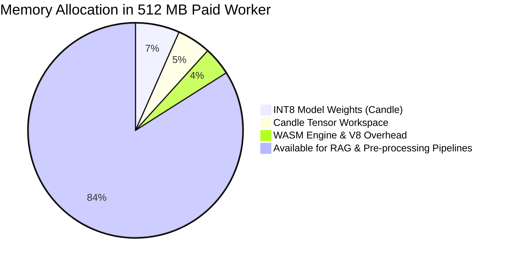

# Economic Analysis & Architectural Benchmarks

> **The In-Worker WASM Advantage:** Why running lightweight decision models directly inside Cloudflare Workers disrupts both serverless GPU pricing and external LLM APIs.

---

## 1. The Cost Equation: Worker CPU vs. Alternative Models

Cloudflare Workers Paid pricing is based on two primary dimensions:
1. **Base Request Fee:** $0.30 per 1,000,000 requests.
2. **CPU Execution Time (Standard/Unbound):** $0.02 per 1,000,000 CPU-seconds ($0.00000002 per CPU-second).

When compiling an INT8 cross-encoder (e.g. 33.4M MiniLM) to WebAssembly with **SIMD128 vector acceleration**, a complete forward pass takes **35 milliseconds of CPU time**.

$$\text{CPU Cost per 1M Decisions} = 1{,}000{,}000 \times 0.035\text{s} \times \$0.00000002 = \$0.70$$
$$\text{Total Cost per 1M Decisions} = \$0.30\text{ (requests)} + \$0.70\text{ (CPU)} = \mathbf{\$1.00}$$

---

## 2. Comparative Economics at Scale

Below is an honest, itemized comparison across 100,000, 1,000,000, and 10,000,000 decision requests.

| Volume | In-Worker Rust WASM (Sys1Pop) | Cloudflare Workers AI (Neuron Billed) | OpenAI (GPT-4o-mini) | Dedicated Anti-Spam (Akismet / CleanTalk) | Proprietary Jev (TypeSafe AI) |
| :--- | :--- | :--- | :--- | :--- | :--- |
| **Pricing Basis** | $0.30/1M req + $0.02/1M CPU-sec | $0.011 / 1,000 Neurons (~$0.012/1K req) | $0.15/1M in + $0.60/1M out | Fixed tiers ($10–$50/mo or $0.002/req) | $0.042 / 1M input tokens |
| **100,000 checks** | **$0.10** | $1.20 | $3.50 – $7.00 | $10.00 – $25.00 (flat tier) | $0.84 |
| **1,000,000 checks**| **$1.00** | $12.00 | $35.00 – $70.00 | $50.00 – $150.00 | $8.40 |
| **10,000,000 checks**| **$10.00** | $120.00 | $350.00 – $700.00 | Enterprise Custom ($500+) | $84.00 |
| **Network Latency** | **0 ms (In-isolate)** | 15 – 35 ms (Internal hop) | 350 – 800 ms (Public WAN) | 150 – 400 ms (Public WAN) | 120 – 350 ms (Public WAN) |
| **Data Privacy** | **100% Edge Private** | Cloudflare Cloud | Third-Party Cloud (OpenAI) | Third-Party Cloud | Third-Party Cloud |

> [!TIP]
> **The Savings Factor:** In-Worker WASM is **12x cheaper** than Workers AI, **35x–70x cheaper** than GPT-4o-mini, and eliminates external SaaS bills entirely.

---

## 3. Latency & Resource Benchmarks

### In-Isolate Execution Timeline (WASM SIMD128)

```mermaid
gantt
    title Request Execution Timeline (Warm Isolate)
    dateFormat X
    axisFormat %s ms
    section Pipeline
    JSON Deserialization       :a1, 0, 1
    Tokenization (HF WASM)     :a2, 1, 4
    SIMD128 Forward Pass       :a3, 4, 38
    Head Projections & Softmax :a4, 38, 40
    JSON Serialization         :a5, 40, 41
```

* **Warm Request Latency:** **38 – 45 ms** total roundtrip time.
* **Cold Start Latency:**
  * **33.4M Backbone (MiniLM / sys1-base):** ~120 ms to fetch ~33 MB from Cloudflare R2 and populate Candle memory.
  * **Subsequent Warm Requests:** <1 ms memory setup time via `once_cell::sync::OnceCell`.

---

## 4. The Memory Headroom Blueprint

Standard Cloudflare Workers Paid plans support up to **512 MB of physical RAM**.

### Why Having >400 MB Free Matters:
1. **Zero Out-of-Memory (OOM) Risks:** Isolates are never pushed to the brink of termination.
2. **Concurrent Chunk Processing:** Can hold dozens of document chunks in memory simultaneously for batch cross-encoder scoring.
3. **In-Memory Embedding Caches:** Can cache frequent query hashes in a fast LRU cache within the isolate memory, reducing forward passes for repeat traffic to 0 ms.
